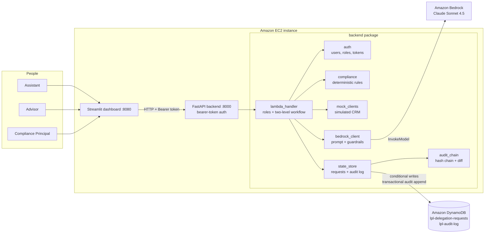
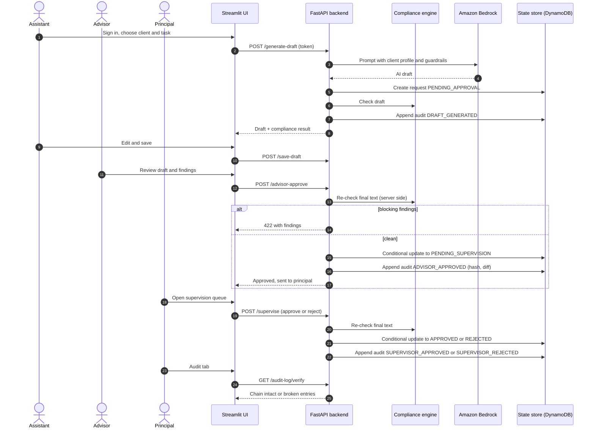
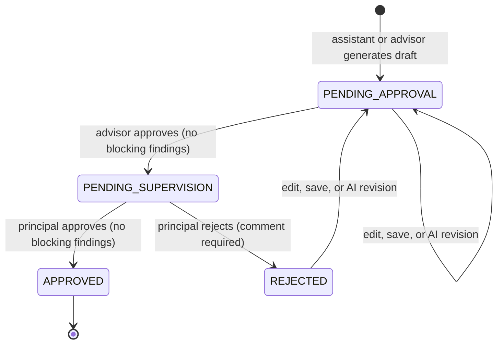
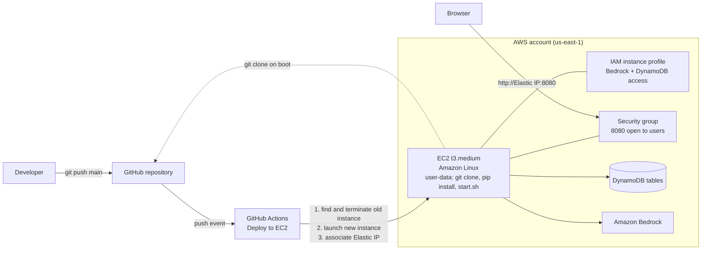
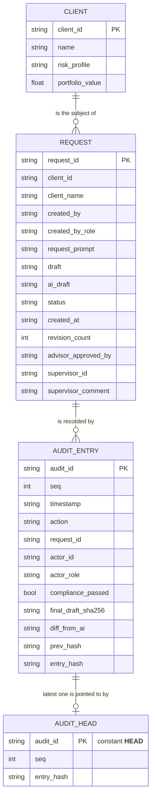

# Architecture

This document describes how the LPL Delegation Assistant is built. The diagrams are Mermaid, which GitHub renders directly; the same sources are stored in [diagrams/](diagrams/) with a static [architecture.svg](diagrams/architecture.svg).

## 1. Purpose

Advisors delegate client-document drafting to an AI assistant while keeping control. Each document passes automated compliance checks, advisor approval and compliance-principal approval, and every step is written to a tamper-evident audit trail.

## 2. System architecture

### Components

| Component | Responsibility | Source |
|---|---|---|
| Streamlit dashboard | Sign-in, drafting, review queues, audit view. No business rules | [frontend/app.py](../frontend/app.py) |
| FastAPI server | Routes, request validation, bearer-token check | [backend/server.py](../backend/server.py) |
| Handlers | Role checks, workflow transitions, orchestration | [backend/lambda_handler.py](../backend/lambda_handler.py) |
| Compliance engine | Deterministic rules on every draft | [backend/compliance.py](../backend/compliance.py) |
| Auth | Users, roles, PBKDF2 hashes, signed tokens, login throttling | [backend/auth.py](../backend/auth.py) |
| State store | Request state and audit log, DynamoDB with local fallback | [backend/state_store.py](../backend/state_store.py) |
| Audit chain | SHA-256 hash chain, verification, diffs | [backend/audit_chain.py](../backend/audit_chain.py) |
| Bedrock client | Prompt construction, model invocation, mock mode | [backend/bedrock_client.py](../backend/bedrock_client.py) |
| Mock clients | Simulated client profiles standing in for a CRM | [backend/mock_clients.py](../backend/mock_clients.py) |

## 3. Request flow

## 4. Request lifecycle

Details and the permission matrix are in [workflow-and-roles.md](workflow-and-roles.md).

## 5. Audit hash chain

```mermaid
flowchart LR
  G["GENESIS"] --> E1
  subgraph E1["Entry seq 1"]
    A1["action, actor, request,<br/>compliance, hashes"]
    H1["prev_hash = GENESIS<br/>entry_hash = SHA-256(entry)"]
  end
  E1 -->|"entry_hash"| E2
  subgraph E2["Entry seq 2"]
    A2["action, actor, request,<br/>compliance, hashes"]
    H2["prev_hash = hash of seq 1<br/>entry_hash = SHA-256(entry)"]
  end
  E2 -->|"entry_hash"| E3
  subgraph E3["Entry seq 3"]
    A3["..."]
    H3["prev_hash = hash of seq 2<br/>entry_hash = SHA-256(entry)"]
  end
  E3 -.->|"latest seq + hash stored in"| HEAD["__HEAD__ item<br/>(updated in the same transaction)"]
  V["GET /audit-log/verify"] -.->|"recomputes every hash,<br/>checks links, sequence and head"| E1
```

## 6. Deployment

See [deployment-and-operations.md](deployment-and-operations.md).

## 7. Data model

Field-level detail is in [data-model.md](data-model.md).

## 8. Key design decisions

| Decision | Reason | Trade-off |
|---|---|---|
| Handlers are framework-agnostic | The same logic can run under FastAPI or Lambda | The Lambda entrypoint needs auth wiring before use |
| Compliance rules are deterministic code, not model prompts | Predictable, testable, explainable to a reviewer | Pattern rules miss subtle problems and can flag false positives |
| Server re-checks compliance at every approval | The client cannot be trusted to enforce the gate | Slight extra work per approval |
| Identity comes only from the signed token | Audit entries cannot be spoofed by request bodies | Needs real user management for production |
| Conditional updates for state changes | Two people cannot approve the same request | Requires DynamoDB conditional writes |
| Hash-chained audit log with a transactional head | Tampering, deletion and reordering are detectable | Tamper-evident only; needs immutable storage for retention |
| DynamoDB with local fallback | Works offline for development | Fallback data is per machine; `REQUIRE_SHARED_STORE=true` disables it |
| Rebuild-on-deploy EC2 | Simple, reproducible instance | Brief downtime on every push to `main` |

## 9. Technology stack

Python 3.11 on EC2 (3.9 compatible), FastAPI and Uvicorn, Streamlit, boto3, Amazon Bedrock (Claude Sonnet 4.5), Amazon DynamoDB, Amazon EC2, GitHub Actions.

## 10. Known limitations

- Client data is simulated; there is no CRM integration.
- Demo accounts and a shared default password are for prototyping only.
- The site is served over plain HTTP without a load balancer or WAF.
- The audit chain is tamper-evident, not tamper-proof; no immutable (WORM) storage yet.
- Compliance rules are simple patterns and do not replace supervisory review.
- The Lambda and SAM path does not authenticate callers yet.
